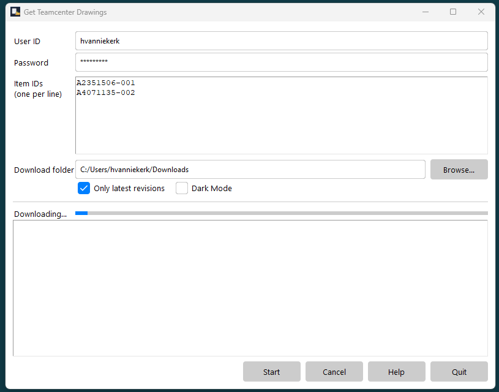
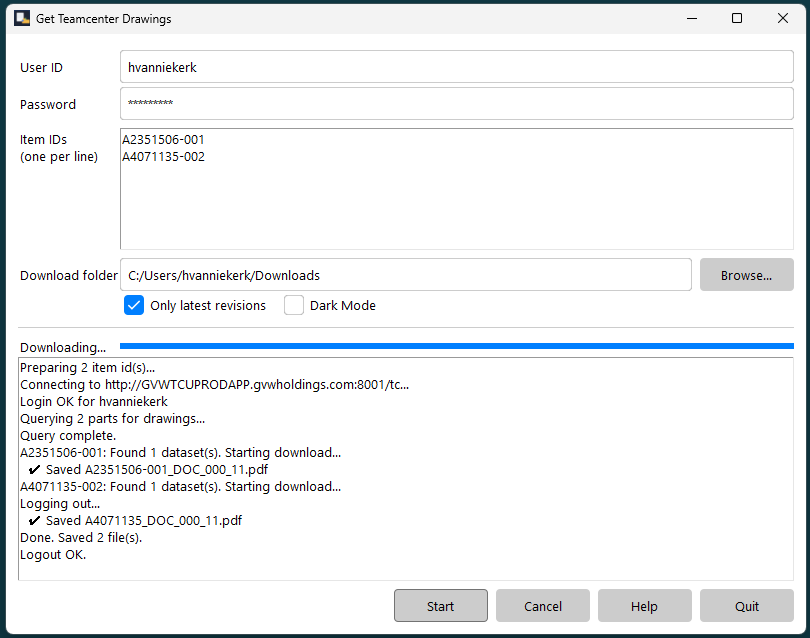

# Python Utility to get drawings from Teamcenter 2406

## Usage

The installation script will place an icon on your desktop.  You can use this to launch the utility.  If your Desktop icon has been deleted, you can find the utility in your local files.The installation script will place the utility here: 

```
C:\Users\<your user name>\AppData\Local\GetTeamcenterDrawings\get_drawings.exe
```

Simply run the utility and enter the part numbers, one part per line.  You can also copy and paste a column of part numbers from Excel.



You must be a Teamcenter user with a username and password that is valid for Teamcenter.  **Hint**: *If you have not recently used Teamcenter, remember that with the roll-out of Teamcenter 2406 In September 2025 you must now use your current Windows password for Teamcenter.*

You can then click on the Start button to start the search and download of the drawings.  Only the latest revision of the part's drawings will be downloaded.

## Output

During the search and download process the results will be shown in the status window.



The LATEST revision of PDF and Excel files for the part will be downloaded and by default be placed in a "downloads" sub-folder, relative to the location from where you run this utility.  The download folder will in turn have sub-folders with the part numbers as names.  Inside each of these sub-folders you will find the documents you are looking for.

You can also use the Folder chooser on the utility main screen to select any other folder for the downloaded files.  You may prefer to use your Windows "Downloads" folder.

You can safely delete the download folder, or else your previous run's file structure will be retained and if you ask for the same part's drawing more than once, then copies name xx_1, xx_2, etc. will be created.

## Teamcenter login

You can place your login details inside a  .env  file in the same folder where you run this utility. This location is typically:
```
C:\Users\<your user name>\AppData\Local\GetTeamcenterDrawings\get_drawings.exe
```
The following information is needed inside this .env file:
```
TCUSER="your_tc_user_name"<br>TCPASSWORD="your_tc_password"
```
The  .env  file is a regular text file that you can create and edit with Notepad.

Happy downloading!